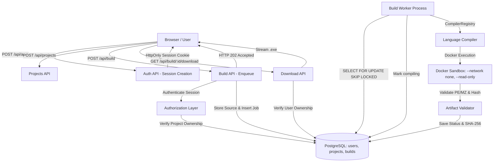

# CodeForge Architecture

## 1. System Overview

CodeForge is a multi-user, containerized code compilation and build management platform. It combines strict user authorization with an asynchronous PostgreSQL job queue and hardened Docker sandboxes.



## 2. Multi-User Authorization Boundaries

1. **User Accounts & Session Handling**:
   - Passwords hashed using industry-standard `scrypt` with unique 16-byte cryptographically secure salts.
   - Sessions stored in PostgreSQL (`sessions` table) with `HttpOnly`, `SameSite=Lax`, and `Secure` (production) cookies.
2. **Project Ownership**:
   - Each project belongs to a `user_id`.
   - Users can only query, build in, or delete their own projects.
3. **Build Ownership**:
   - Builds store `user_id` and `project_id` foreign keys.
   - `GET /api/build/:id`, `POST /api/build/:id/cancel`, and `GET /api/build/:id/download` verify `build.userId === authenticatedUser.id`.
4. **Anonymous & Legacy Builds**:
   - Legacy builds with `user_id = NULL` are treated as public sandbox builds.
   - User-owned builds are private to their creator.

## 3. Asynchronous Build Lifecycle & State Machine

```
[QUEUED] ───> [COMPILING] ───> [SUCCESS]
    │               │
    ├──> [CANCELLED]├───> [COMPILE_ERROR]
    │               ├───> [TIMEOUT]
    │               ├───> [SECURITY_REJECTED]
    │               └───> [INTERNAL_ERROR]
    │
    └──> (Stale Worker Timeout) ───> [QUEUED (retry)] / [INTERNAL_ERROR]
```

## 4. Local Development Commands

**Terminal 1 (Next.js App Server):**
```bash
npm run dev
```

**Terminal 2 (Standalone Worker Process):**
```bash
npm run worker
```
